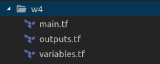
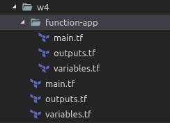

# Wprowadzenie do Terraform z wykorzystaniem platformy Azure

##### Karol Masuhr

###### #terraform #azure #serverless #awesomeness #rkś

---

### Po co to?

Celem szkolenia jest poznanie narzędzia **Terraform** na przykładzie tworzenia środowiska serverless w Azure.

---

### Wymagania:

* Komputer
* RDP client 
* Znajomość **memów** na poziomie podstawowym

---

### Co to jest ten Ażur?

### Myślisz sobie przecież wiem, chmura to wirtualne maszyny.

---


---

### Co to jest ten Ażur?

Azure (i inni dostawcy) poza wirtualnymi maszynami udostępniają nam wiele innch usług takich jak Serverless Application, Databases, Virtual Networks i wiele innych.

Polecam zapoznać sie w wolnym czasie z linkiem poniżej. 

https://chmurowisko.pl/serwisy-microsoft-azure/


---

### Co to jest ten Terraform

> Hashicorp Terraform to narzędzie typu open source do obsługi i zarządzania infrastruktury w chmurze.

Lista zasobów dostepnych w ramach **Azure**.
Warto mieć tę stronę pod ręką, przyda się podczas warsztatów.

https://www.terraform.io/docs/providers/azurerm/

---

### Preparation

###### Azure Portal signin

http://portal.azure.com

| Username       | Password          |
| -------------- | ----------------- |
| spam@masuhr.pl | Spójrz na tablicę |

###### Azure CLI login

1. Uruchom komendę w terminalu `az login`
2. Potwierdź logowanie w nowo uruchomionym oknie przeglądarki

###### Clone repository

https://bitbucket.pgs-soft.com/scm/dog/terraform-azure-workshop.git

---

### Workshop #1

###### Cel

1. Zapoznanie się z podstawowymi elementami Terraforma.
	* variable
	* resource
	* output
2. Zapoznanie się z podstawowymi komendami
3. Parametryzacja pierwszej infrastruktury - dodanie prefixu do nazwu **Resource groupy**, prefix powinien być podawany jako **input variable**.
4. Wypisanie na konsolę nazwy stworzonej **Resource groupy**

---

### Workshop #1

### Podstawowe komendy

1. `terraform init` - pobranie bibliotek koniecznych do komunikacji z dostawcą usług
4. `terraform plan`
5. `terraform apply`
6. `terraform destroy`

---

### Workshop #1

```
variable "prefix" {
  type        = "string"
  description = "Pierwsza litera imienia i nazwisko pisane łącznie."
}

variable "location" {
  type    = "string"
  default = "westus"
}

resource "azurerm_resource_group" "workshop" {
  name     = "${var.prefix}-workshop-rg"
  location = "${var.location}"
}

output "resource_group_name" {
  value = "${azurerm_resource_group.workshop.name}"
}
```

---

### Workshop #2

###### Cel

Stworzyć **Function App** przy użyciu narzędzia terraform. Zadanie zostaje zaliczone jeśli na koniec działania otrzymamy url działającego Function Appa.

###### Zasoby do utworzenia

* Resource Group
    * location: `westus`
* Storage Account
    * account_tier: `Standard`
    * account_replication_type: `LRS`
* App Service Plan
	* sku: `{tier = "Standard", size = "S1"}` 
* Function App

---

### Workshop #3

###### Cel

Deployment appki *Hello world* w nodeJS przy pomocy **Azure CLI** i **Terraform**


###### Azure CLI

`az functionapp deployment source config-zip --src 'function-app-hello-world.zip' --resource-group $RESOURCE_GROUP --name $FUNCTION_APP_NAME`

---

### Workshop #3

###### Provisioners

Używane są do wykonywania skryptów lokalnie bądź na zdalnej maszynie.

https://www.terraform.io/docs/provisioners/index.html

###### Terraform

Użycie polecenia **Azure CLI** wewnątrz Terraforma. Do tego celu użujemy `null_resource`.

```
resource "null_resource" "helloworld_function" {
  provisioner "local-exec" {
    command = "az functionapp deployment...
  }
}
```
---

### Workshop #4

###### Cel - modularyzacja

1. Wydzielenie z głównego pliku elementów odpowiedzialnych za **zamienne (variables)** i **wyjścia (outputs)**



2. Stworzenie modułu `function-app` zawierającego: `azurerm_storage_account` `azurerm_app_service_plan` oraz `azurerm_function_app`



---

```
module "function_app" {
  source = "./function-app"

  prefix              = "${var.prefix}"
  location            = "${var.location}"
  resource_group_name = "${azurerm_resource_group.workshop.name}"
}
```

* `module` - slowo kluczowe
* pierwsze ciapki - nazwa naszego modułu
* `source` - lokalizacja modułu
* podobnie jak w przypadku `resource` podajemu parametry


---

### Linki

https://chmurowisko.pl/serwisy-microsoft-azure/

https://www.terraform.io/docs/configuration/index.html

https://www.terraform.io/docs/providers/azurerm/index.html

---

# Koniec

